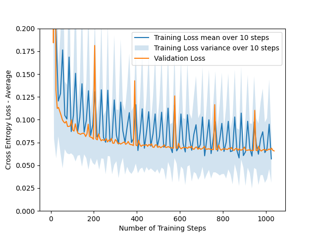
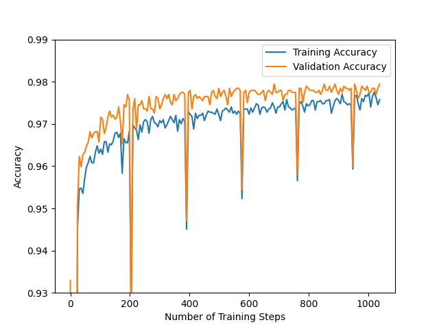
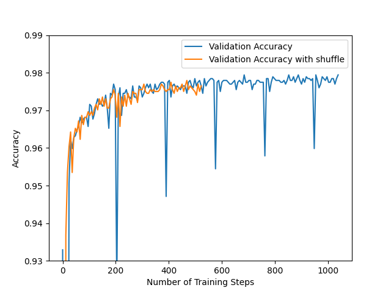
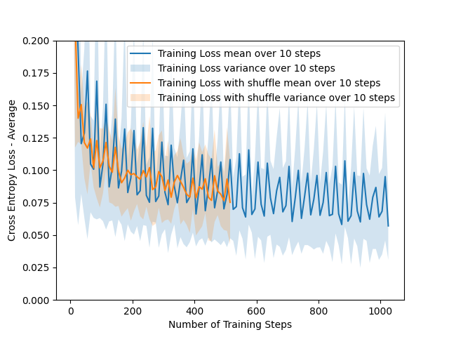
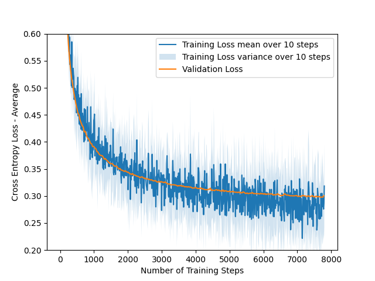
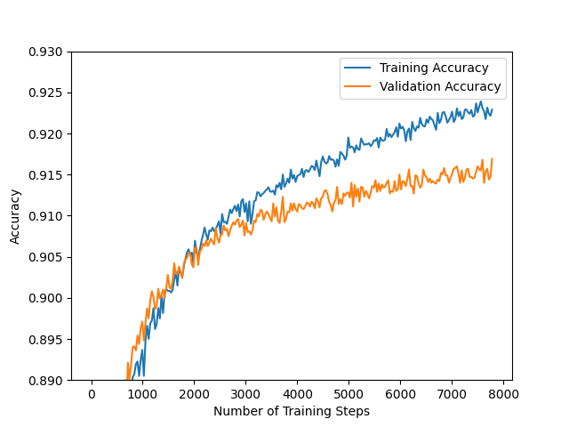
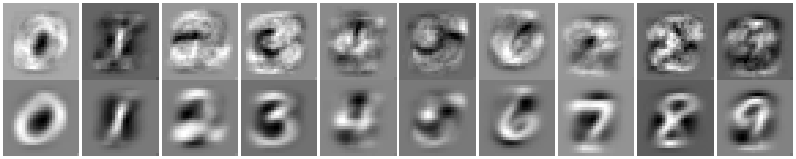
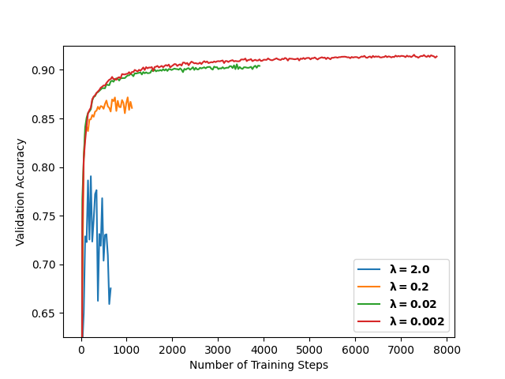
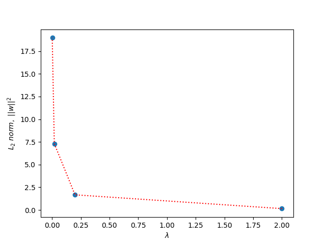

\clearpage
# Task 1


## (a)

We start with the following known equation:
$$\begin{aligned}
&&&C(w)&&=\frac{1}{N}\sum_{n=1}^{N}C^n, \text{ where } C^n(w)=-(y^n\ln(\hat{y}^n)+(1-y^n)\ln(1-\hat{y}^n))\\
&\text{And the simplification: } &&\hat{y}^n&&=f(x^n)=f\\
&\text{And the hint that: }&&\frac{\partial f(x^n)}{\partial w_i}&&=x_i^n f(x^n)(1-f(x^n))
\end{aligned}$$

We apply the chain rule to solve the partial derivative, this gives us:
$$
\frac{\partial C^n(w)}{\partial w_i}=\frac{\partial C^n(w)}{\partial f}\cdot\frac{\partial f}{\partial w_i}
$$

We then start solving the partial derivatives:

$$\begin{aligned}
\frac{\partial C^n(w)}{\partial f}&=\frac{\partial (-(y^n\ln(\hat{y}^n)+(1-y^n)\ln(1-\hat{y}^n)))}{\partial f}\\
&=\frac{\partial (-y^n\ln(f)+(1-y^n)\ln(1-f))}{\partial f}\\
&=\frac{\partial (-y^n\ln(f))}{\partial f}+\frac{\partial ((1-y^n)\ln(1-f)))}{\partial f}\\
&=(-y^n)\frac{\partial \ln(f)}{\partial f}+(1-y^n)\frac{\partial \ln(1-f)}{\partial f}\\
&=\frac{-y^n}{f}+\frac{1-y^n}{1-f}\\
&=\frac{-y^n(1-f)+f(1-y^n)}{f(1-f)}\\
&=\frac{-y^n+fy^n+f-y^nf}{f(1-f)}\\
&=\frac{-y^n+f}{f(1-f)}\\\\
\end{aligned}$$

From the hint we already have that:
$$\begin{aligned}
\frac{\partial f}{\partial w_i}&=x_i^n f(x^n)(1-f(x^n)=x_i^nf(1-f)\\
\end{aligned}$$


Put these together and we get that:

$$\begin{aligned}
\frac{\partial C^n(w)}{\partial w_i}&=\frac{\partial C^n(w)}{\partial f}\cdot\frac{\partial f}{\partial w_i}\\
&=\frac{-y^n+f}{\cancel{f(1-f)}}\cdot x_i^n\cdot \cancel{f(1-f)} \\
&=(-y^n+f)x_i^n=(-y^n+\hat{y}^n)x_i^n\\
&=\underline{\underline{\bm{-(y^n-\hat{y}^n)x_i^n}}}
\end{aligned}$$


## (b)

We have the cross-entropy cost function for multiple classes defined as:
$$
C(w)=\frac{1}{N}\sum_{n=1}^NC^n(w)\text{ , where } C^n(w)=-\sum_{k=1}^Ky_k^n\ln(\hat{y}_k^n)
$$
Further, we have that:

$$\begin{aligned}
\hat{y}_k&=\frac{e^{z_k}}{\sum_{k'}^K(e^{z_{k'}})}\\
z_k&=\sum_i^Iw_{k,i}x_i\\
\end{aligned}$$

We are also using that:

$$\begin{aligned}
\sum_{k=1}^Ky_k^n&=1\\
\end{aligned}$$

This leaves us with:
$$\begin{aligned}
\frac{\partial C^n(w)}{\partial w_{k,j}}&=\frac{\partial (-\sum_{k=1}^Ky_k^n\ln(\hat{y}_k^n))}{\partial w_{k,j}}\\
&=\frac{\partial}{\partial w_{k,j}}(-\sum_{k=1}^Ky_k^n\ln(\hat{y}_k^n))\\
&=\frac{\partial}{\partial w_{k,j}}(-\sum_{k=1}^Ky_k^n\ln(\frac{e^{w_{k,j}x_j^n}}{\sum_{k'}^Ke^{w_{k,j}x_j^n}}))\\
&=\frac{\partial}{\partial w_{k,j}}(-\sum_{k=1}^Ky_k^n(w_{k,j}x_j^n-\ln(\sum_{k'}^Ke^{w_{k,j}x_j^n})))\\
&=\frac{\partial}{\partial w_{k,j}}(-y_k^n(w_{k,j}x_j^n-\ln(\sum_{k'}^Ke^{w_{k,j}x_j^n})))\\
&=\frac{\partial}{\partial w_{k,j}}(-y_k^nw_{k,j}x_j^n+y_k^n\ln(\sum_{k'}^Ke^{w_{k,j}x_j^n}))\\
&=-y_k^nx_j^n+\frac{x_j^ne^{w_{k,j}x_j^n}}{\sum_{k'}^Ke^{w_{k,j}x_j^n}}\\
&=-y_k^nx_j^n+x_j^n\frac{e^{w_{k,j}x_j^n}}{\sum_{k'}^Ke^{w_{k,j}x_j^n}}\\
&=-x_j^ny_k^n+x_j^n\hat{y}_k^n\\
&=\underline{\underline{\bm{-x_j^n(y_k^n-\hat{y}_k^n)}}}
\end{aligned}$$


\clearpage
# Task 2

## (b)

{width=80%}

## (c)

{width=80%}

## (d)

When we use the condition specified of passing through 20% of the dataset 10 times without seeing an improvement (the validation loss is higher than the lowest measured 10 times in a row), the **Early stopping happens after 33 Epochs**. And from the output:

```sh
Early stopping at epoch: 33
Final Train Cross Entropy Loss:      0.07088705555893647
Final Validation Cross Entropy Loss: 0.06577187753329566
Train accuracy:      0.9757802746566792
Validation accuracy: 0.9794319294809011
```

We see that it achieved a train accuracy of 97.6% and a validation accuracy of 97,9%.

## (e)


{#fig:2e1 width=80%}

We can clearly see in [@fig:2e1] how the shuffle removes the ''spikes'' we get when we don't shuffle the batches. This happens if the batches are organized in such a way that the weights might overfit to simpler batches and fail to generalize. This means the model will have a decently high accuracy for the ''easy'' batches and everytime it encounters the difficult one it will struggle. If we shuffle the batches however we prevent a such organization occuring (at least reducing the chances of it occuring). And in turn this leads to better generalization and a more even ''learning curve''.


\clearpage
The output when using shuffle looks like this:

```sh
Early stopping at epoch: 16
Final Train Cross Entropy Loss:      0.07924553698509086
Final Validation Cross Entropy Loss: 0.07166134981545134
Train accuracy:      0.9735330836454432
Validation accuracy: 0.9764936336924583
```
We see that it achieved a train accuracy of 97.4% and a validation accuracy of 97,6% when early stopping at epoch 16. And from the plotted loss in [@fig:2e2] we can also see how this generalization makes the curve more smooth (removes the large spikes both for easy batches (low loss), and difficult ones (high loss)).

{#fig:2e2 width=80%}

\clearpage
# Task 3

## (b)

{#fig:3b width=80%}

## (c)

{#fig:3c width=80%}

## (d)

In [@fig:3c] we see early signs of overfitting.

Overfitting is when the model is not generalizing anymore but is starting to sacrifice generality with getting high scores on the training data. This is bad as this eventually will lead to the model being very good at the data it has trained on, but bad at any new/validation data (essentially the validation accuracy will start to decrease).

From [@fig:3c] we see how the training and validation accuracy start to diverge already in training step 2000-3000. However the validation accuracy is still increasing so it is not actually overfitted yet, but if the number of epochs were to increase i would expect we start to see the validation accuracy flatten out or start to decrease as the training accuracy approaches 100%.


\clearpage
# Task 4
## (a)
We have that

$$\begin{aligned}
&J(w)=C(w)+\lambda R(w)\\
\text{and }&R(w)=||w||^2=\frac{1}{2}\sum_{i,j}w_{i,j}^2
\end{aligned}$$

We start by recognizing that we have already solved a part of the partial derivative of $J(w)$ in Task **1b**:
$$
\frac{\partial C(w)}{\partial w}=-x_j^n(y_k^n-\hat{y}_k^n)
$$

This means that the update term for softmax regression with $L_2$ regularization is:

$$\begin{aligned}
\frac{\partial J(w)}{\partial w}&=\frac{\partial C(w)}{\partial w}+\lambda\frac{\partial R(w)}{\partial w}\\
&=\frac{\partial C(w)}{\partial w}+\lambda\frac{\partial ||w||^2}{\partial w}\\
&=\frac{\partial C(w)}{\partial w}+\lambda 2 w\\
&=\underline{\underline{\bm{-x_j^n(y_k^n-\hat{y}_k^n)+2\lambda w}}}\\
\end{aligned}$$

## (b)

{#fig:4b width=100%}

From [@fig:4b] we see that the model with regularization (bottom) is a lot less noisy then the one without it. This happens because the regularization prevents the model from getting too complex by reducing the cost function. In essence this means that a model with high regularization will prevent overfitting because the model will struggle to learn more complex features. From the figure we see how the model without regularization starts to become a blurry mess as it is trying to learn what the numbers look like based on very specific pixels in the training data, instead of generalizing.

## (c)

{#fig:4c width=95%}

## (d)

[@fig:4c] shows us how the validation accuracy degrades when applying more regularization. The reason for this is that although regularization can prevent overfitting, having too much regularization can produce underfitting, where the model will be too simple to be able to learn the features necessary. We see this as the model with $\lambda=2$ is not able to learn much other than the major differences between the digits and instead has a wildly fluctuating accuracy simply based on luck.

## (e)

{#fig:4e width=95%}

We notice how the length of the weight vector decreases as the lambda value for the regularization increases. This makes sense as the higher lambda values will have a simpler model, which just means it will have less ''area''  to store information (if we imagine the length of the weight vector as the ''learnable area'').