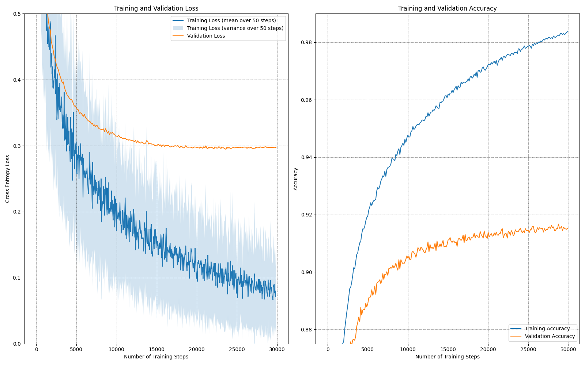
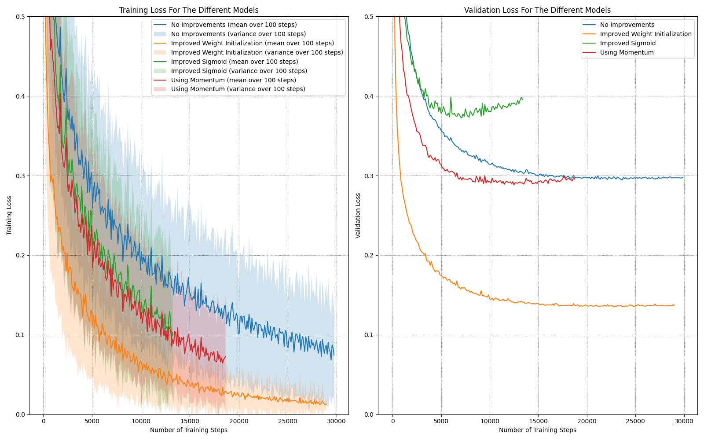
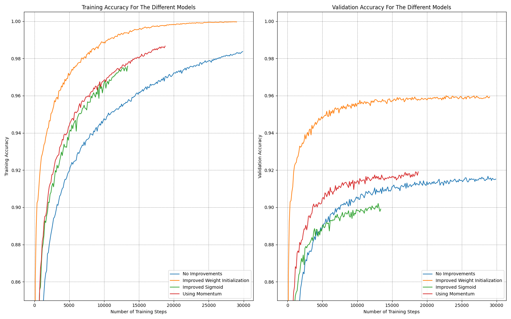
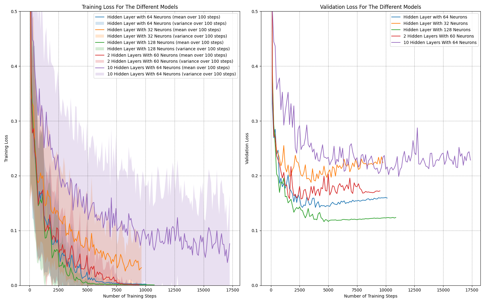
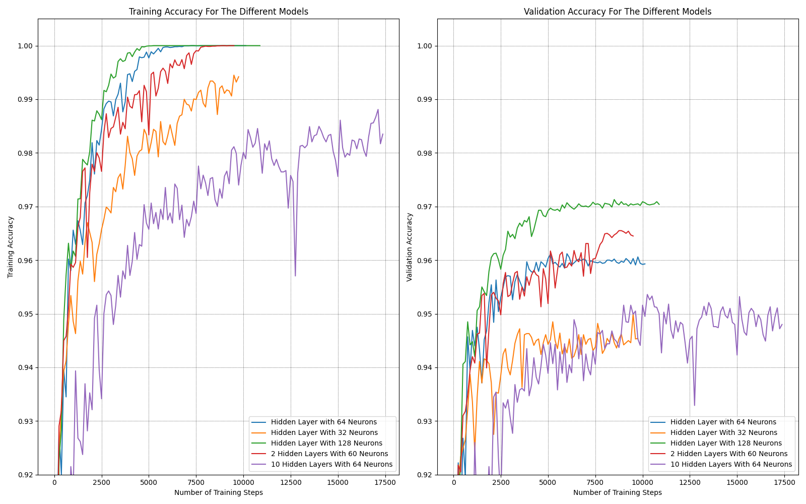

\clearpage
# Task 1

## (a)

We will be using the following definitions and equations:
$$\begin{aligned}
    w_{ji}&:=w_{ji}-\alpha\frac{\partial C}{\partial w_{ji}}\\
    w_{kj}&:=w_{kj}-\alpha\frac{\partial C}{\partial w_{kj}}=w_{kj}-\alpha\delta_k a_j\\
    \delta_j &= \frac{\partial C}{\partial z_j} \\
    \frac{\partial z_j}{\partial w_{ji}}&=x_i\\
\end{aligned}$$


Using these we can see that:
$$\begin{aligned}
    w_{ji}&:=w_{ji}-\alpha\frac{\partial C}{\partial w_{ji}}\\
    &:=w_{ji}-\alpha\frac{\partial C}{\partial z_j}\frac{\partial z_j}{\partial w_{ji}}\\
    &:=\underline{\underline{w_{ji}-\alpha\delta_j x_i}}\\
\end{aligned}$$

And we also get that:
$$\begin{aligned}
    \delta_{j}&=\frac{\partial C}{\partial z_{j}}\\
    &=\frac{\partial C}{\partial a_{j}}\frac{\partial a_{j}}{\partial z_{j}}\\
    &=\frac{\partial C}{\partial a_{j}}f'(z_{j})\\
    &=\left(\sum_{k} \frac{\partial C}{\partial z_{k}}\frac{\partial z_{k}}{\partial a_{j}}\right)f'(z_{j})\\
    &=\left(\sum_{k} \delta_k\frac{\partial z_{k}}{\partial a_{j}}\right)f'(z_{j})\\
    &=\left(\sum_{k} \delta_k\frac{\partial(\sum_j w_{kj}a_j)}{\partial a_j}\right)f'(z_{j})\\
    &=\left(\sum_{k} \delta_kw_{kj}\right)f'(z_{j})\\
    &=\underline{\underline{f'(z_j)\sum_k w_{kj}\delta_k}}
\end{aligned}$$

## (b)

Now i must admit that i kind of forgot that i skipped this task as i didn't quite understand what it asked for, so due to time constraints lets just assume that the correct answer is written in white below:


\clearpage
# Task 2

## (a)

Using all images from the training dataset (60 000 images) to find the mean pixel value and standard deviation gives:

```txt
mean pixel value   = 33.318421449829934
standard deviation = 78.56748998339798
```

The calculation and the pre processing is implemented in the file  **task2ab.py**.


## (c)

{#fig:task2c}

|                            | Train Loss | Validation Loss | Train Accuracy | Validation Accuracy |
|:---------------------------|:-----------|:----------------|:---------------|:--------------------|
| Hidden Layer With 64 Nodes | 0.0765     | 0.2978          | 98.370%        | 91.520%             |
: Final Results {#tbl:task2c}

## (d)

To find the total number of parameters in the network from Task 2c we simply add the number of biases and weights for each layer together.

$$\begin{aligned}
(784\text{ inputs}+1\text{ bias})*64+64*10&=\underline{\underline{50 880\text{ Parameters}}}
\end{aligned}$$


\clearpage
# Task 3

All subtasks are implemented in the files **task2ab.py**, **task2c.py** and **task3.py**. All the models have been placed in the same figures for easy and compact comparison.

The subtasks for adding the different ''Tricks of the Trade'' are:

- Task 3a: Improved Weight Initialization
- Task 3b: Improved Sigmoid
- Task 3c: Using Momentum

The results are shown in [@fig:task3l] and [@fig:task3a]. When applying the ''Tricks of the Trade'' only that specific improvement is applied to the base model, this should make it easy to see exactly how each improvement affects the results. It is also worth noting that for Task3c the *learning rate* is also reduced from $0.1$ to $0.02$.

{#fig:task3l}

{#fig:task3a}


|                                | Train Loss | Validation Loss | Train Accuracy | Validation Accuracy |
|:-------------------------------|:-----------|:----------------|:---------------|:--------------------|
| No Improvements                | 0.0765     | 0.2978          | 98.370%        | 91.520%             |
| Improved Weight Initialization | 0.0131     | 0.1366          | 99.960%        | 95.940%             |
| Improved Sigmoid               | 0.0991     | 0.3954          | 97.590%        | 89.910%             |
| Using Momentum                 | 0.0621     | 0.2955          | 98.665%        | 91.910%             |
: Table of the final results for each model after adding each of the improvements {#tbl:task3}

As stated all subtasks and improvements are against the base model (blue, No Improvements).

## (a)

We notice how the model with improved weight initialization (yellow) drastically improves the models loss and accuracy, as well as its learning speed (how fast the results improve). We see how the loss of the model even converges, unlike the base model that, although the loss is decreasing, has a high loss variance ([@fig:task3l]). When comparing the training and validation accuracy ([@fig:task3a]) as well, we see how this model is able to achieve almost 100% on the training data, while also getting a much higher score on the validation data.

This means the improved weight initialization greatly improves the models generalization.

## (b)

The model with improved sigmoid (green) gives both reduced and quickly decreasing loss during training ([@fig:task3l]), and a slightly faster learning speed ([@fig:task3a]). We notice however how this addition makes the model prone to overfitting, as we see how the validation loss starts to increase again after 5000 training steps, even while the training loss is steadily decreasing ([@fig:task3l]). This then affects the validation accuracy and we see how it actually ends up lower than for the base model ([@fig:task3a]). This could however be remedied by combining the improved sigmoid with the improved weight initialization where the risk of overfitting will be reduced by the improved generalization of the improved weights.

This improvement is the one that reduces the training time the most, stopping after only 14 000 training steps, compared to the base models 30 000. As such it is a useful tool as long as one is aware of the overfitting risk.

## (c)

The results of the model that uses momentum (red), is almost exactly the same as they were without momentum (in terms of the final results in [@tbl:task3]). This means that momentum does not effect the final accuracy or loss of the model much. However what it does do, is greatly increase the learning speed and convergence speed of the model. We see this in how the graphs are much steeper, and end sooner than for the base model (early stopping after 17 500 steps).

In other words, momentum allows us to get the ''same results'' faster.


\clearpage
# Task 4

Lets start by plotting all the different models in the same figures to more easily compare them against eachother. The results are shown in [@fig:task4l] and [@fig:task4a]. As stated in the assignment all the models will apply all of the ''Tricks of the Trade'' from Task 3.

{#fig:task4l}

{#fig:task4a}

The different subtasks will refer to these figures for their respective comparisons and explanations, along with [@tbl:task4].

|                                  | Train Loss | Validation Loss | Train Accuracy | Validation Accuracy |
|:---------------------------------|:-----------|:----------------|:---------------|:--------------------|
| Hidden Layer with 64 Neurons     | 0.0018     | 0.1593          | 100.000%       | 95.930%             |
| Hidden Layer With 32 Neurons     | 0.0266     | 0.2237          | 99.420%        | 94.540%             |
| Hidden Layer With 128 Neurons    | 0.0009     | 0.1238          | 100.000%       | 97.040%             |
| 2 Hidden Layers With 60 Neurons  | 0.0009     | 0.1724          | 100.000%       | 96.450%             |
| 10 Hidden Layers With 64 Neurons | 0.0587     | 0.2285          | 98.350%        | 94.800%             |
: The final results for each model using the different topologies. {#tbl:task4}

Once again all subtasks will be compared to the base model (blue) with a single hidden layer with 64 neurons.

## (a)

The model with half the neurons in the hidden layer (yellow) struggles with the complexity of the problem. We see that it starts overfitting to the training data quite quickly ([@fig:task4l]) as it doesn't have enough parameters to allow it to be generalized. We also see the effects of this in [@fig:task4a] where the validation accuracy quickly flattens out, while the training accuracy increases.


## (b)

The model with (128) twice the amount of neurons (green) seems to learn at almost the same rate as the base model, we see how the training loss/accuracy are almost equal, however the increased complexity of this model allows it to generalize better, and because of that its validation accuracy is higher, and loss is lower than that of the base model ([@fig:task4a]).


## (d)

To find the number of neurons in the hidden layers, using that both hidden layers had to have the same amount of neurons, i ended up with 60 neurons in each hidden layer because:

$$\begin{aligned}
(784+1)*60+60*60+60*10&=\underline{\underline{50\ 386 \text{ parameters}}}\\
\end{aligned}$$

In other words the network has:

- 784 Input Neurons + 1 bias
- 2 hidden layers with 60 Neurons
- 10 output Neurons

This is the closest we can get to the model used in Task 3c (same number of parameters as model calculated in Task 2d: 50 880) without having a different number of neurons in each layer.

Since the model with 2 hidden layers (red) has almost the same amount of parameters we would expect it to be not too different than that of the base model. And based on the graphs we can see that the models do infact behave quite similarly, however the model with 2 layers is actually able to be more generalized than the model with a single layer. we see this from [@fig:task4a] where the double layer model spends longer to get a perfect score for the training data, while also getting an increased score on the validation data.

## (e)

Finally the model with 10 hidden layers with 64 neurons each (purple) takes quite a while longer to train than the other models ($4s/epoch$ compared to $\approx1s/epoch$), it also required a lot more epochs before converging and early stopping kicking in. This model is wildly overfitting, it doesn't look that bad but that is due to the fact that it has so many parameters that it takes a while for changes to occur, but we see how the validation loss starts to increase ([@fig:task4l]) and the validation accuracy ([@fig:task4a]) plateaus at the same level as the model with only 32 neurons. It also has major dips/spikes indicating that model is quite sensitive due to the variance in loss being quite high.
