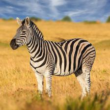

\clearpage

# Task 1 {-}

## (a) {-}

The convolution is visualized in [@fig:task1a], the multiplications and additions are not written out. The explanation part visualizes with colors how the values from the flipped kernel, and the respective area in the original image is multiplied and then summed together.

{#fig:task1a}

## (b) {-}

Out of the following:

(i) Convolutional Layer
(ii) Activation Function
(iii) Max Pooling

**(iii) Max Pooling** is the one that reduces the sensitivity to small translational variations in the output. This is because maxpooling will take the highest value of a range and return that as the new value, meaning with a MaxPooling kernel of size $3\times3$, if the highest value pixel in the image was located at the leftmost pixel of a kernel, and it was moved 2 pixels to the right, the output of that maxpooling kernel will be exactly the same. The same logic applies in all translational directions (up, down, left, right).

\clearpage
## (c) {-}

We have:
$$\begin{aligned}
    \text{kernel}&=F_H\times F_W&&=5\times5\\
    \text{stride}&=S_H\times S_W&&=1\times1\\
    \text{filters}&             &&=6\\
    \text{Width out = Width in}&\rightarrow W_1=W_2&&=W\\
    \text{Height out = Height in}&\rightarrow H_1=H_2&&=H\\
\end{aligned}$$

To find the Padding in Width ($P_W$) and Height ($P_H$), we use equation 1 and 2 from "*A Brief Introduction to Convolutional Neural Networks*". This gives us:

$$\begin{aligned}
    W_2 &=\frac{W_1 - F_W +2P_W}{S_W} + 1\\
    W &=\frac{W - F_W +2P_W}{S_W} + 1\\
    S_W(W-1) &=W - F_W + 2P_W\\
    S_W(W-1)-W + F_W &= 2P_W\\
    P_W&=\frac{S_W(W-1)-W + F_W}{2}\\
    P_W&=\frac{W-1-W + 5}{2}\\
    \bm{P_W}&=\frac{4}{2}=\bm{2}\\
    \\
    &\text{and}\\
    \\
    P_H&=\frac{S_H(H-1)-H + F_H}{2}\\
    P_H&=\frac{H-1-H + 5}{2}\\
    \bm{P_H}&=\frac{4}{2}=\bm{2}\\
\end{aligned}$$

We see that we should use a padding of $P_H\times P_W=\underline{\underline{2\times2}}$.

\clearpage
## (d) {-}

We know that:
$$\begin{aligned}
    \text{size of original image}&=H_1\times W_1=512\times512\\
    \text{number of layers}&=2\\
    \text{spatial dimensions of the feature maps in the first layer}&=H_2\times W_2=504\times504\\
    \text{number of feature maps in the first layer}&=12\\
\end{aligned}$$

And we are told that we can assume:

$$\begin{aligned}
    \text{kernels}&=N\times N &&\text{where $N$ is odd}\\
    \text{stride}&=S_H\times S_W&&=1\times1\\
    \text{padding}&=P_H\times P_W&&=0\times0\\
\end{aligned}$$

Again, using equation 1 and 2 from "*A Brief Introduction to Convolutional Neural Networks*", we get for the first layer that:

$$\begin{aligned}
    W_2 &=\frac{W_1 - F_W +2P_W}{S_W} + 1\\
    S_W(W_2-1)-W_1- 2P_W&=-F_W\\
    F_W &=-S_W(W_2-1)+W_1+ 2P_W\\
        &= -1(504-1)+512+ 2*0 \\
        &= -504+1+512 \\
        &= 9 \\
    \\
    \text{and}\\
    \\
    F_H &=-S_H(H_2-1)+H_1+ 2P_H\\
        &= -1(504-1)+512+ 2*0 \\
        &= -504+1+512 \\
        &= 9 \\
\end{aligned}$$

In other words, we get a kernel size in layer 1 of $F_H \times F_W = \underline{\underline{\bm{9} \times \bm{9}}}$

\clearpage
## (e) {-}

We have that:

$$\begin{aligned}
    \text{Input} &= H_1\times W_1 = 504\times504\\
    \text{Stride} &= S_H\times S_W=2\times2 \\
    \text{Subsampling Window Size} &=F_H\times F_W= 2\times2 \\
    \text{Padding} &=P_H\times P_W= 0\times0 \\
\end{aligned}$$

We get that the spatial dimensions of the pooled feature maps are:

$$\begin{aligned}
    H_2 &\times W_2 \\
    \frac{H_1-F_H+2P_H}{S_H}+1&\times\frac{W_1-F_W+2P_W}{S_W}+1\\
    \frac{504-2+2*0}{2}+1&\times\frac{504-2+2*0}{2}+1\\
    \frac{502}{2}+1&\times\frac{502}{2}+1\\
    \bm{252}&\times\bm{252}\\
\end{aligned}$$

## (f) {-}

We have that:

$$\begin{aligned}
    \text{Input} &= H_1\times W_1 = 252\times252\\
    \text{Kernel Size} &=F_H\times F_W= 3\times3 \\
    \text{Stride} &= S_H\times S_W=1\times1 \\
    \text{Padding} &=P_H\times P_W= 0\times0 \\
\end{aligned}$$

Which gives us a resulting dimension of the feature maps of:

$$\begin{aligned}
    H_2 &\times W_2 \\
    \frac{H_1-F_H+2P_H}{S_H} +1 &\times \frac{W_1 -F_W +2P_W}{S_W} +1 \\
    \frac{252 -3+2*0}{1} +1 &\times \frac{252 -3+2*0}{1} +1\\
    249 +1 &\times 249 +1\\
    \bm{250} &\times \bm{250}\\
\end{aligned}$$

\clearpage
## (g) {-}

The image has dimensions $32\times32$ and is RGB ($32\times32\times3$). Using the network outlined in [@tbl:task2model] we get the following number of parameters for each layer:

|    Layer    |                                     | Weights | Biases |       Parameters |
|:-----------:|------------------------------------:|--------:|-------:|-----------------:|
|      n      | $F_H\times F_W\times C_1\times C_2$ |         |  $C_2$ | Weights + Biases |
|             |                                     |         |        |                  |
|      1      |        $5\times 5\times 3\times 32$ |   2 400 |     32 |            2 432 |
|      2      |       $5\times 5\times 32\times 64$ |  51 200 |     64 |           51 264 |
|      3      |      $5\times 5\times 64\times 128$ | 204 800 |    128 |          204 928 |
|      4      |                $(4*4*128)\times 64$ | 131 072 |     64 |          131 136 |
|      5      |                       $64\times 10$ |     640 |     10 |              650 |
|             |                                     |         |        |                  |
| $\sum_1^5n$ |                                     |  390112 |    298 |          390 410 |

We see that the network has a total of **390 410** parameters.

\clearpage
# Task 2 {-}

\begin{table}[H]
    \centering
    \caption{Replica of Table 1 from the assignment. All \textit{filters have size $5\times5$} with \textit{Padding=2} and \textit{Stride=1}. The \textit{MaxPool2D} layers has \textit{kernel size $2\times2$} and \textit{Stride=2}.}
    \begin{tabular}{  c | l  c  l  }
        Layer & Type    & Filters / Hidden Units & Activation Function \\
        \hline
        1   & Conv2D          &          32            & ReLU \\  
            & MaxPool2D       &            -           & -\\
        2   & Conv2D          &           64           & ReLU \\
            & MaxPool2D       &           -            & -\\
        3   & Conv2D          &          128           & ReLU \\
            & MaxPool2D       &           -            & -   \\
        \hline
            & Flatten         &           -            & -\\
        4   & Fully-Connected &           64           & ReLU\\
        5   & Fully-Connected &           10           & Softmax\\
        \hline
    \end{tabular}
    \label{tbl:task2model}
\end{table}

| Hyperparameter   | value |
|:-----------------|:-----:|
| Optimizer        |  SGD  |
| Batch Size       |  64   |
| Learning Rate    | 0.05  |
| Early Stop Count |   4   |
| Epochs           |  10   |
: Hyperparameters for Model in Task 2.
{#tbl:task2}

## (a)  {-}

![Training + Validation Loss and Validation Accuracy for CNN Model described in [@tbl:task2model].](../results/task2.png){#fig:task2a}

\clearpage
## (b)  {-}

The final accuracies of the model[^1] is written in [@fig:task2a], and is also stated in [@tbl:task2b].

[^1]: The Final Accuracies are after the ''best model'' is loaded (model with lowest validation loss during training). This will be the case for all models. For the model described here that means the accuracies reported are from the model that has trained $\approx$ 5000 epochs.

| Dataset    | Accuracy |
|:-----------|---------:|
| Train      |   87.28% |
| Validation |   74.29% |
| Test       |   73.58% |
: Final Accuracies of CNN model from [@tbl:task2model].
{#tbl:task2b}

\clearpage
# Task 3 {-}

## (a) {-}

### Model 1 {-}

The first model is an exact replica of the model from [@tbl:task2model]. The only differences are listed in [@tbl:task3aModel1].

| Hyperparameter |  value  |
|:---------------|:-------:|
| Optimizer      |  Adam   |
| Learning Rate  | 0.00049 |
: Hyperparameters for Model 1. Anything not listed are kept the same as they were in task 2 ([@tbl:task2]), this is also the case for model 2:
{#tbl:task3aModel1}

{#fig:task3a1}

### Model 2 {-}

For my second model i wanted to increase the models complexity by adding more layers. In doing this i increased the learning rate to speed up the learning while also adding Dropout to two of the layers to ''force'' the model to generalize. The Complete network is described in [@tbl:task3model2] and hyperparamters are listed in [@tbl:task3aModel2].

\begin{table}[H]
    \centering
    \caption{Model 2. All \textit{filters have size $5\times5$} with \textit{Padding=2} and \textit{Stride=1}. The \textit{MaxPool2D} layers has kernel size $2\times2$ and \textit{Stride=2}.}
    \begin{tabular}{  c | l  c  l  }
        Layer & Type    & Filters / Hidden Units & Activation Function \\
        \hline
        1   & Conv2D          &          32            & ReLU \\  
            & MaxPool2D       &           -            & -\\
        2   & Conv2D          &           64           & ReLU \\
            & MaxPool2D       &           -            & -\\
        3   & Conv2D          &          128           & ReLU \\
            & MaxPool2D       &           -            & -   \\
        \hline
            & Flatten         &            -           & -\\
            & Dropout(0.4)    &            -           & -\\
        4   & Fully-Connected &           256          & ReLU\\
        5   & Fully-Connected &           128          & ReLU\\
            & Dropout(0.2)    &            -           & -\\
        6   & Fully-Connected &           64           & ReLU\\
        7   & Fully-Connected &           32           & ReLU\\
        8   & Fully-Connected &           10           & Softmax\\
        \hline
    \end{tabular}
    \label{tbl:task3model2}
\end{table}

| Hyperparameter | value |
|:---------------|:-----:|
| Learning Rate  | 0.15  |
: Hyperparameters for Model 2.
{#tbl:task3aModel2}

{#fig:task3a2}

## (b) {-}

The final results for the two models are listen in [@tbl:task3b]:

| Dataset    | Model 1 Accuracy | Model 2 Accuracy |
|:-----------|:----------------:|:----------------:|
| Training   |      86.53%      |      85.65%      |
| Validation |      75.12%      |      75.18%      |
| Test       |      75.09%      |      75.22%      |
: Accuracies (in percent) for the two models described in Task 3a.
{#tbl:task3b}

From the table we that **Model 2** has the best results. Its training and validation loss, along with its validation accuracy is plotted in [@fig:task3a2].

## (c) {-}

I believe i got quite lucky with the improvements i wanted to test in such that the first things i tried worked well enough that i managed to squeeze them over 75% test accuracy. But that being said to get it over 80% in Task 3e i tried a few more improvements and here is the general impression i have of the positive effects of each of them (keeping in mind that too much of any of them can slo lead to negative effect, but using each of them in fitting amounts should give the effects listed):

| Improvement                    | Effect                                          |
|:-------------------------------|:------------------------------------------------|
| Adam Optimizer                 | Increased Learning rate                         |
| More Classification Layers     | Able to learn distinguish between more features |
| More Feature Extraction Layers | Able to extract more features                   |
| Dropout                        | Prevent overfitting                             |
| Data Augmentation              | Better generalization                           |
| Batch Normalization            | Faster Training                                 |

## (d) {-}

Based on the limited experimentation i performed before both models were above 75% i found the biggest improvement after adding Dropout to Model 2.

As we can see the model overfits much less and is able to achieve far better generalization.

## (e) {-}

After some more experimentation with improvements i ended up with this model:

\begin{table}[H]
    \centering
    \caption{My Best Model. All \textit{filters have size $5\times5$} with \textit{Padding=2} and \textit{Stride=1}. The \textit{MaxPool2D} layers has kernel size $2\times2$ and \textit{Stride=2}.}
    \begin{tabular}{ c | l  c  l  }
        Layer & Type    & Filters / Hidden Units & Activation Function \\
        \hline
        1   & Conv2D            &          32           & ReLU      \\  
            & BatchNorm2D       &           -           &  -        \\
        2   & Conv2D            &          32           & ReLU      \\
            & MaxPool2D         &           -           &  -        \\
        3   & Conv2D            &          64           & ReLU      \\
            & BatchNorm2D       &           -           &  -        \\
        4   & Conv2D            &          64           & ReLU      \\
            & MaxPool2D         &           -           &  -        \\
        5   & Conv2D            &         128           & ReLU      \\
            & BatchNorm2D       &          -            &   -       \\
        6   & Conv2D            &         128           & ReLU      \\
            & MaxPool2D         &          -            &  -        \\
        \hline
            & Flatten           &           -           &   -       \\
            & Dropout(0.4)      &           -           &   -       \\
        7   & Fully-Connected   &           128         & ReLU      \\
        8   & Fully-Connected   &           64          & ReLU      \\
            & Dropout(0.2)      &           -           &   -       \\
        9   & Fully-Connected   &           64          & ReLU      \\
        10  & Fully-Connected   &           10          & Softmax   \\
        \hline
    \end{tabular}
    \label{tbl:task3e}
\end{table}

| Hyperparameter | value  |
|:---------------|:------:|
| Optimizer      |  Adam  |
| Batch Size     |   32   |
| Learning Rate  | 0.0006 |
: Hyperparameters for my best model.
{#tbl:task3e}

In addition to this i added **Data Augmentation** with:

- Random Horizontal Flip (50% probability)
- Random Rotations from -10\textdegree\ to 10\textdegree
- ColorJitter (0.5 for brightness, contrast, saturation and hue)

The results of the model are seen in [@fig:task3e].

{#fig:task3e}

## (f) {-}

As we can see from the train and validation loss in [@fig:task3e], the validation and training loss are pretty much equal at all times, this means the model doesn't show any signs of over/under-fitting. The model would be underfitting if the validation loss failed to keep up with the training loss, and overfitting if the validation loss had started to increase as the model overfits to the training data. This is also backed up by how the model has almost equal training and test accuracy.

\clearpage
# Task 4 {-}

## (a) {-}

{#fig:task4a}

The hyperparamters used by the model from [@fig:task4a] are listed in [@tbl:task4a].

|               | Value                     |
|:--------------|:--------------------------|
| Optimizer     | Adam                      |
| Batch Size    | 32                        |
| Learning Rate | 0.0005 ($5\times10^{-4}$) |
: Hyperparameters used for training the ResNet18 model on CIFAR10.
{#tbl:task4a}

The following transformationa were also applied to the images:

- Resize to $224\times224$
- Normalization with:
  - mean      $=(0.485, 0.456, 0.406)$
  - std \quad $=(0.229, 0.224, 0.225)$

## (b) {-}

{width=30%}

![Visualization of filters and activations in ResNet18 on "zebra.jpg". Each column visualizes the $7 \times 7$ filter (top) of the first layer, and the corresponding grayscale activation (bottom). This is done on the following indices: [14, 26, 32, 49, 52]](../results/Task4b.png){#fig:task4b}

In [@fig:task4b] we see how the filters extract different features in the image. Each of the filters extracts the following features:

| Filter | Feature                            | Example that has this feature  |
|-------:|:-----------------------------------|:-------------------------------|
|     14 | Vertical lines                     | Stripes and edges of the Zebra |
|     26 | Horizontal Lines                   | Stripes and edges of the Zebra |
|     32 | Blue Color                         | The Sky                        |
|     49 | Diagonal Lines (Down to the right) | Stripes and edges of the Zebra |
|     52 | Green Color                        | The Grass (yellow=green+red)   |

## (c) {-}

{#fig:task4c}

At this point in the model the activations no longer make much sense to us humans, but we can notice how all of the highest activations (yellow) are in what seems to be locations of the zebra. For instance:

- activation 0: The legs of the zebra
- activation 6: The head of the zebra