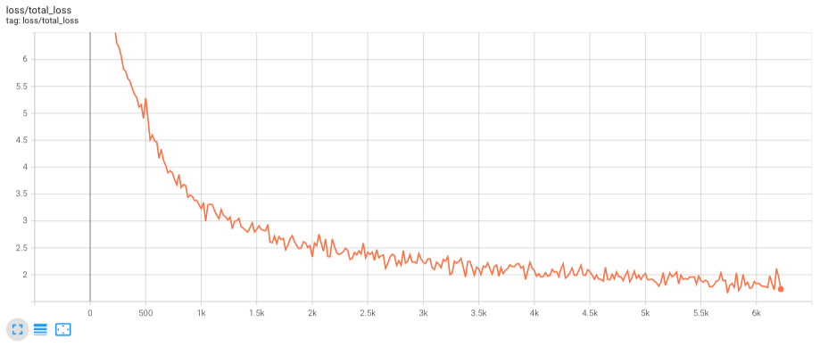
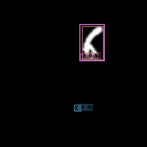
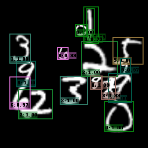
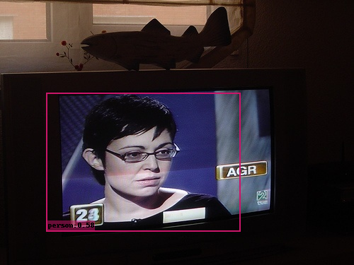
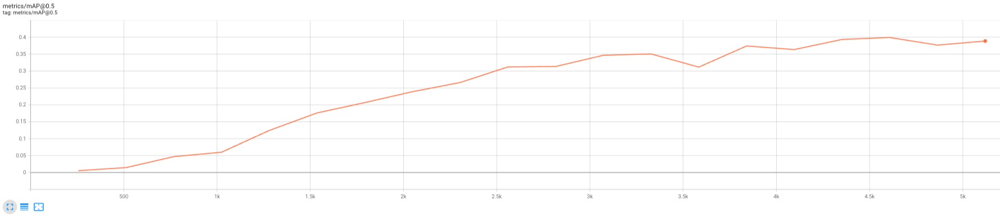

[1]: https://jonathan-hui.medium.com/ssd-object-detection-single-shot-multibox-detector-for-real-time-processing-9bd8deac0e06 "SSD Blog Post by Jonathan Hui"
[2]: https://link.springer.com/chapter/10.1007/978-3-319-46448-0_2#citeas "SSD: Single Shot MultiBox Detector."

# Task 1

## (a)

*Intersection over Union* or *IoU* is simply the intersection of two boxes divided by the union of the two. In other words the IoU is higher the more of the two are overlapping. This is expressed as:

$$\text{IoU}(A,B)=\frac{\text{Intersection of $A$ and $B$}}{\text{Union of $A$ and $B$}}=\frac{A\cap B}{A\cup B}$$

This is very easily demonstrated using a VENN-diagram:

{#fig:task1a width=40%}

For bounding boxes this means we can find how ''good'' a bounding box is using the *IoU*, where a value of 1 is a perfect match, 0 is no match.

## (b)

When using precision and recall it is normal to use the following abbreviations:

$$\begin{aligned}
    \text{True Positive}&\rightarrow\text{TP}\\
    \text{False Positive}&\rightarrow\text{FP}\\
    \text{True Negative}&\rightarrow\text{TN}\\
    \text{False Negative}&\rightarrow\text{FN}\\
\end{aligned}$$

{#fig:task1b width=40%}

A true positive (TP) is where the actual case is positive and the model correctly selected it as positive.

A false positive (FP) is where the actual case is negative but the model wrongly selected it as a positive.

Using the abbreviations we get precision and recall is defined as:

$$\begin{aligned}
    \text{Precision}&=\frac{\text{Number of correct positive predictions}}{\text{Number of positive predictions}}&&=\frac{TP}{TP+FP}\\
    \text{Recall}&=\frac{\text{Number of correct positive predictions}}{\text{Actual number of positives}}&&=\frac{TP}{TP+FN}\\
\end{aligned}$$

\clearpage
## (c)

Using the values given in the assignment we interpolate to get the precision values for recall levels [0.0, 0.1, ..., 1.0]. When interpolating we use the closest value we have to the right of the relevant recall level (ie. to find the value for recall level $0.3$, we find the closest known precision for a recall level greater than $0.3$, for class 1 this would be recall level $0.4$ with $precision=1.0$). The interpolated values are shown in [@tbl:task1c].

\begin{table}[H]
    \centering
    \caption{Interpolated Precision and Recall Curves}
    \label{tbl:task1c}
    \subfloat[Class 1]
    {
        \begin{tabular}{|c|c|}
            \hline
            Recall & Precision \\
            \hline
            0.0   &    1.0 \\
            0.1   &    1.0 \\
            0.2   &    1.0 \\
            0.3   &    1.0 \\
            0.4   &    1.0 \\
            0.5   &    0.5 \\
            0.6   &    0.5 \\
            0.7   &    0.5 \\
            0.8   &    0.2 \\
            0.9   &    0.2 \\
            1.0   &    0.2 \\
            \hline
        \end{tabular}
    }
    \qquad
    \subfloat[Class 2]
    {
        \begin{tabular}{|c|c|}
            \hline
            Recall & Precision \\
            \hline
            0.0   &    1.0 \\
            0.1   &    1.0 \\
            0.2   &    1.0 \\
            0.3   &    1.0 \\
            0.4   &    0.8 \\
            0.5   &    0.6 \\
            0.6   &    0.5 \\
            0.7   &    0.5 \\
            0.8   &    0.2 \\
            0.9   &    0.2 \\
            1.0   &    0.2 \\
            \hline
        \end{tabular}
    }
\end{table}

Using the Precision and recall curves from [@tbl:task1c], we first calculate the average precision ($AP$) for both classes:

$$\begin{aligned}
\text{Class 1: }AP_1&=\frac{\sum_{0.0}^{1.0}\text{Precision}_1}{11}=\frac{1.0+1.0+1.0+1.0+1.0+0.5+0.5+0.5+0.2+0.2+0.2}{11}=0.6454\\
\text{Class 2: }AP_2&=\frac{\sum_{0.0}^{1.0}\text{Precision}_2}{11}=\frac{1.0+1.0+1.0+1.0+0.8+0.6+0.5+0.5+0.2+0.2+0.2}{11}=0.6363\\
\end{aligned}$$

We can then calculate the mean average precision ($mAP$, essentially the average of the average precisions) of the two models with:

$$\begin{aligned}
mAP=\frac{AP_1+AP_2}{2}&=\frac{0.6454+0.6363}{2}=\underline{\underline{0.64085}}\\
\end{aligned}$$


\clearpage
# Task 2

All subtasks are implemented in **task2/task2.py**.

## (f)

{#fig:task2f}


\clearpage
# Task 3

## (a)

When performing inference with SSD, we filter out a set of overlapping boxes using **Non-Maximum Suppression**.

## (b)

The statement:

*Predictions from the deeper layers in SSD are responsible to detect small objects.*

is **False**.

When using SSD, higher-resolution feature maps are responsible for detecting smaller objects.[^1]

[^1]: [SSD Blog Post by Jonathan Hui][1]

## (c)

They use different bounding box aspect ratios at the same spatial location because different object sizes and shapes are easier detected by some aspect ratios than others.

![Demonstration how different objects match certain aspect ratios better than others.[^1]](images/box-ratio.jpeg){width=50%}

\clearpage
## (d)

The main difference between *SSD* and *YOLO* is that the *YOLO* architecture consists of fully connected layers while *SSD* only consists of CNN layers. This means that *SSD* is able to classify the same objects at different sizes, while *YOLO* only can classify objects of a certain size.

*SSD predicts bounding boxes from several feature maps from the backbone network. YOLO V1/v2 does not do this.*

![A comparison between SSD and YOLO network architecture[^2]](images/yolo-ssd.png){width=70%}

[^2]: [SSD: Single Shot MultiBox Detector.][2]

## (e)

Because the feature maps is of size $38\times38$, we have $38\cdot38$ anchor points, and we have $6$ anchors, this means that for this feature map we have:

$$38\cdot38\cdot6=\bm{8664}\text{ anchor boxes}$$

## (f)

The total number of anchor boxes for this network is:

$$\begin{aligned}
&38\cdot38\cdot6&&+19\cdot19\cdot6&&+10\cdot10\cdot6&&+5\cdot5\cdot6&&+3\cdot3\cdot6&&+1\cdot1\cdot6&&=\\
&8664&&+2166&&+600&&+150&&+54&&+6&&=\text{\textbf{11 640}}\\
\end{aligned}$$


\clearpage
# Task 4

*I included a makefile in the assignment_code.zip (SSD/makefile) that contains the commands i used for each of the following subtasks.*

## (a)

The model is implemented in **SSD/ssd/modeling/backbones/basic.py**.

## (b)

{#fig:task4b}

The final result of the model was:
```txt
Average Precision  (AP) @[ IoU=0.50      | area=   all | maxDets=100 ] = 0.74065
```

In other words the model achieves **Mean Average Precision** $\bm{\approx74\%}$

## (c)

To improve the model I:

- changed the filter sizes and padding for a few layers
- increased number of filters for some layers
- changed the optimizer and the learning rate
- added batch normalization and dropout
- changed the normalization values used on the data

The model is implemented in **SSD/ssd/modeling/backbones/basic_improved.py**, and the hyperparamters and normalization were changed in the file **SSD/configs/ssd300_improved.py**.

The complete model is shown in [@tbl:task4c-model] and the hyperparameters used are listed in [@tbl:task4c-hyper].

\begin{table}[H]
    \centering
    \caption{The Improved Model. Using output$\_$channels $=[$256, 512, 256, 128, 64, 64$]$}
    \begin{tabular}{ | l | l | c | c | c | c | }
        \hline
        Is Output                       & Layer Type    & Number of Filters        & Kernel Size & Stride & Padding \\
        \hline
                                        &  Conv2d       &         32               &      5      &    1    &    2   \\
                                        &  BatchNorm2d  &         -                &      -      &    -    &    -   \\
                                        &  Dropout(0.1) &         -                &      -      &    -    &    -   \\
                                        &  ReLU         &         -                &      -      &    -    &    -   \\
                                        &  MaxPool2d    &         -                &      2      &    2    &    -   \\
                                        &  Conv2d       &         64               &      5      &    1    &    2   \\
                                        &  BatchNorm2d  &         -                &      -      &    -    &    -   \\
                                        &  Dropout(0.1) &         -                &      -      &    -    &    -   \\
                                        &  ReLU         &         -                &      -      &    -    &    -   \\
                                        &  MaxPool2d    &         -                &      2      &    2    &    -   \\
                                        &  Conv2d       &         128              &      5      &    1    &    3   \\
                                        &  BatchNorm2d  &         -                &      -      &    -    &    -   \\
                                        &  Dropout(0.1) &         -                &      -      &    -    &    -   \\
                                        &  ReLU         &         -                &      -      &    -    &    -   \\
                                        &  Conv2d       &   output$\_$channels[0]  &      5      &    2    &    2   \\
                                        &  BatchNorm2d  &         -                &      -      &    -    &    -   \\
        Yes - Resolution $38\times38$   &  ReLU         &         -                &      -      &    -    &    -   \\
        \hline
                                        &  ReLU         &         -                &      -      &    -    &    -   \\
                                        &  Conv2d       &         256              &      5      &    1    &    2   \\
                                        &  ReLU         &         -                &      -      &    -    &    -   \\
                                        &  Conv2d       &   output$\_$channels[1]  &      5      &    2    &    2   \\
        Yes - Resolution $19\times19$   &  ReLU         &         -                &      -      &    -    &    -   \\
        \hline
                                        &  ReLU         &         -                &      -      &    -    &    -   \\
                                        &  Conv2d       &         512              &      5      &    1    &    2   \\
                                        &  ReLU         &         -                &      -      &    -    &    -   \\
                                        &  Conv2d       &   output$\_$channels[2]  &      5      &    2    &    2   \\
        Yes - Resolution $10\times10$   &  ReLU         &         -                &      -      &    -    &    -   \\
        \hline
                                        &  ReLU         &         -                &      -      &    -    &    -   \\
                                        &  Conv2d       &         256              &      3      &    1    &    1   \\
                                        &  ReLU         &         -                &      -      &    -    &    -   \\
                                        &  Conv2d       &   output$\_$channels[3]  &      3      &    2    &    1   \\
        Yes - Resolution $5\times5$     &  ReLU         &         -                &      -      &    -    &    -   \\
        \hline
                                        &  ReLU         &         -                &      -      &    -    &    -   \\
                                        &  Conv2d       &         128              &      3      &    1    &    1   \\
                                        &  ReLU         &         -                &      -      &    -    &    -   \\
                                        &  Conv2d       &   output$\_$channels[4]  &      3      &    2    &    1   \\
        Yes - Resolution $3\times3$     &  ReLU         &         -                &      -      &    -    &    -   \\
        \hline
                                        &  ReLU         &         -                &      -      &    -    &    -   \\
                                        &  Conv2d       &         128              &      3      &    1    &    1   \\
                                        &  ReLU         &         -                &      -      &    -    &    -   \\
                                        &  Conv2d       &   output$\_$channels[5]  &      3      &    1    &    0   \\
        Yes - Resolution $1\times1$     &  ReLU         &         -                &      -      &    -    &    -   \\
        \hline
    \end{tabular}
    \label{tbl:task4c-model}
\end{table}

| Hyperparameter |  value   |
|:---------------|:--------:|
| Optimizer      |  $Adam$  |
| Batch Size     |   $32$   |
| Learning Rate  | $0.0005$ |
: Hyperparameters for the improved model.
{#tbl:task4c-hyper}

The **mean** and **std** values used for normalization fo the data were changed to the ones used in the previous assignment:

- **mean**      $=(0.485, 0.456, 0.406)$
- **std** \quad $=(0.229, 0.224, 0.225)$

The loss of the model is seen in [@fig:task4c-loss], and the Mean Average Precision is shown in [@fig:task4c-precision].

{#fig:task4c-loss}

{#fig:task4c-precision}

As we can see it reached a $mAP>85\%$ three times within the 10K iterations, these are listed in [@tbl:task4c-peak].

|  Steps | $mAP$  |
|-------:|:------:|
|  6 864 | 85.68% |
|  7 800 | 85.99% |
| 10 296 | 86.92% |
: Instances where the $mAP$ was above 85% for the model.
{#tbl:task4c-peak}

The final Mean Average Precision of the model with $IoU$ Threshold $=0.5$ after the full 33 epochs (10 296 iterations) was **86.92%**:

```txt
Average Precision  (AP) @[ IoU=0.50      | area=   all | maxDets=100 ] = 0.86920
```

\clearpage
## (e)

:::{#fig:task4e}
{#fig:task4e-0 width=25%}\  
{#fig:task4e-1 width=25%}\  
{#fig:task4e-2 width=25%}\  
{#fig:task4e-3 width=25%}

{#fig:task4e-4 width=25%}\  
{#fig:task4e-5 width=25%}\  
{#fig:task4e-6 width=25%}\  
{#fig:task4e-7 width=25%}

{#fig:task4e-8 width=25%}\  
{#fig:task4e-9 width=25%}\  
{#fig:task4e-10 width=25%}\  
{#fig:task4e-11 width=25%}

{#fig:task4e-12 width=25%}\  
{#fig:task4e-13 width=25%}\  
{#fig:task4e-14 width=25%}

The output of using the model trained in Task 4c on the images in the **SSD/demo/mnist** folder.
:::

As we can see in [@fig:task4e] there are a few instances where my model isn't able to detect a number (such as in (b), (c), (g) and (n)). There are also instances where my model finds numbers that aren't there, or where it finds the same number several times (as can for instance be seen in (b), (c), (d), (e), (g), (i), (j), (k) and (o)). It seems my model is overly eager to classify things which leads to a lot more false positives than false negatives.

## (f)

:::{#fig:task4f}
{#fig:task4f-0 width=50%}\  
{#fig:task4f-1 width=50%}  

{#fig:task4f-2 width=70%}

{#fig:task4f-3 height=2in}\  
{#fig:task4f-4 height=2in}  

The output after training the pre-trained VGG16 model on the voc dataset for 5000 iterations, then using the model on the images in the **SSD/demo/voc** folder.
:::

The loss of the model during training is seen in [@fig:task4f-loss], and the Mean Average Precision is shown in [@fig:task4f-precision].

{#fig:task4f-loss}

{#fig:task4f-precision}