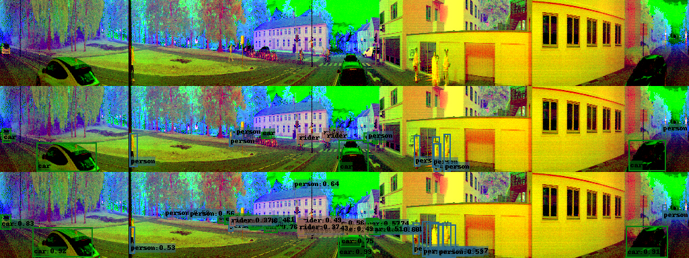
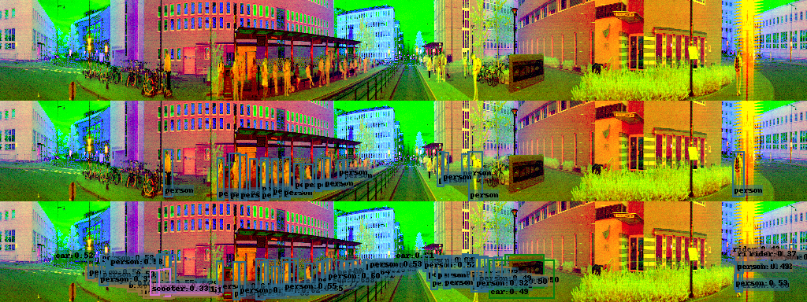

# TDT4265 Project

To run any of the tasks, first make sure you have installed all dependencies with:
```sh
./tasks/prep.sh
```

Then run each task with:
```sh
./tasks/<task>-<subtask>.sh
```

for instance to run the code for task 1.1 (data exploration) use:
```sh
./tasks/1-1.sh
```


# Results

Images are stacked in the following way:

- top: Original Image where the RGB channels = Depth, Ambient and Intensity
- middle: Ground Truth Boxes annotated manually by humans
- bottom: Anchor Boxes from the trained model on the original image.





