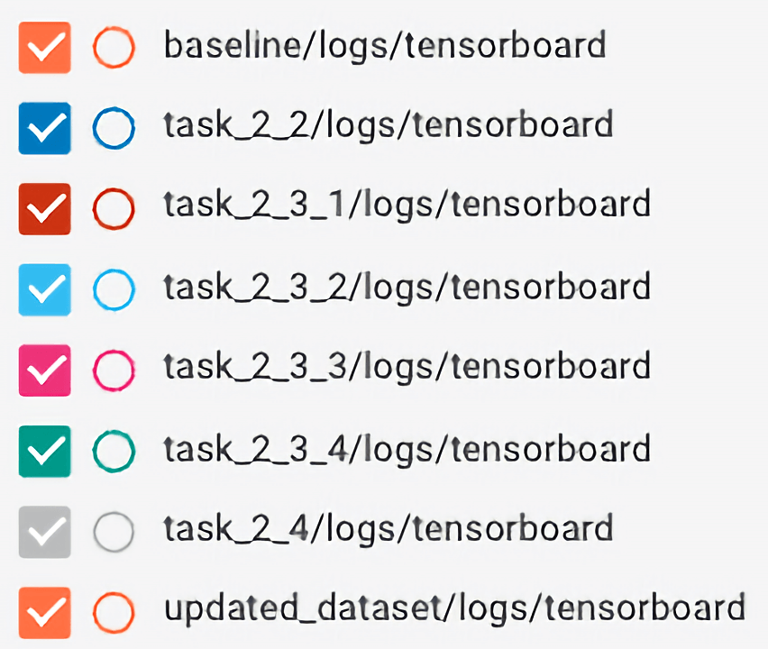
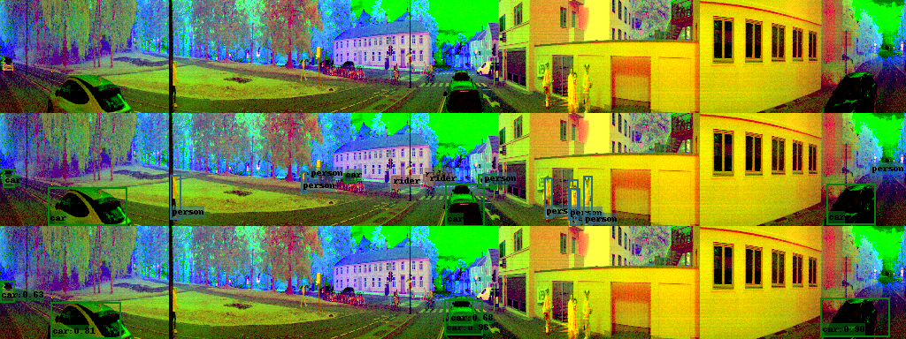
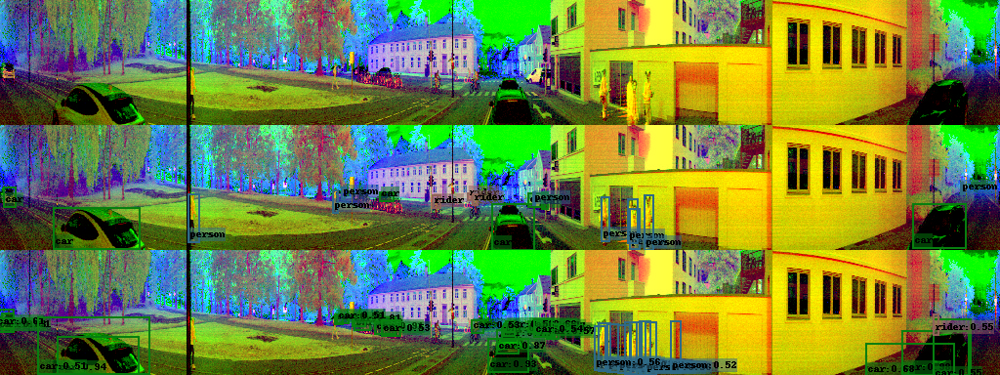

# General Information {-}

For convince i have created a couple scripts that can be used to reproduce each of the tasks results in the project. These are all located in the **tasks** folder of the .zip. To run a task all that is needed is to do:

```sh
./tasks/<task>-<subtask>.sh
```

Due to time constraints all training was limited to 1000 iterations, with the exception of task 2.5 when training on the updated dataset with my best model.

Further, all plots of mAP and loss were taken directly from Tensorboard, and they all use the legend in [@fig:legend], I will attempt to specify what each color is in each figure caption.

{#fig:legend}


\clearpage
\setcounter{section}{1}
# Model Creation

Note that some quantitative results are not listed until section 3.1.

## Creating the first Baseline

The model was copied directly from assignment 4 and tweaked according to the tips given in the project description. The model is found in the file **ssd/modeling/backbones/baseline_model.py**.

For completeness sake the full model structure is shown in [@tbl:model-baseline], all hyperparamters and configurations are in the file **configs/baseline.py**.

\begin{table}[H]
    \centering
    \caption{The Improved Model. Using output$\_$channels $=[$128, 256, 128, 128, 64, 64$]$}
    \begin{tabular}{ | l | l | c | c | c | c | }
        \hline
        Is Output                       & Layer Type    & Number of Filters        & Kernel Size & Stride & Padding \\
        \hline
                                        &  Conv2d       &         32               &      3      &    1    &    1   \\
                                        &  ReLU         &         -                &      -      &    -    &    -   \\
                                        &  MaxPool2d    &         -                &      2      &    2    &    -   \\
                                        &  Conv2d       &         64               &      3      &    1    &    1   \\
                                        &  ReLU         &         -                &      -      &    -    &    -   \\
                                        &  Conv2d       &         64               &      3      &    1    &    1   \\
                                        &  ReLU         &         -                &      -      &    -    &    -   \\
                                        &  Conv2d       &   output$\_$channels[0]  &      3      &    2    &    1   \\
        Yes - Resolution $32\times256$  &  ReLU         &         -                &      -      &    -    &    -   \\
        \hline
                                        &  Conv2d       &         128              &      3      &    1    &    1   \\
                                        &  ReLU         &         -                &      -      &    -    &    -   \\
                                        &  Conv2d       &   output$\_$channels[1]  &      3      &    2    &    1   \\
        Yes - Resolution $16\times128$  &  ReLU         &         -                &      -      &    -    &    -   \\
        \hline
                                        &  Conv2d       &         256              &      3      &    1    &    1   \\
                                        &  ReLU         &         -                &      -      &    -    &    -   \\
                                        &  Conv2d       &   output$\_$channels[2]  &      3      &    2    &    1   \\
        Yes - Resolution $8\times64$    &  ReLU         &         -                &      -      &    -    &    -   \\
        \hline
                                        &  Conv2d       &         128              &      3      &    1    &    1   \\
                                        &  ReLU         &         -                &      -      &    -    &    -   \\
                                        &  Conv2d       &   output$\_$channels[3]  &      3      &    2    &    1   \\
        Yes - Resolution $4\times32$    &  ReLU         &         -                &      -      &    -    &    -   \\
        \hline
                                        &  Conv2d       &         128              &      3      &    1    &    1   \\
                                        &  ReLU         &         -                &      -      &    -    &    -   \\
                                        &  Conv2d       &   output$\_$channels[4]  &      3      &    2    &    1   \\
        Yes - Resolution $2\times16$    &  ReLU         &         -                &      -      &    -    &    -   \\
        \hline
                                        &  Conv2d       &         128              &      3      &    1    &    1   \\
                                        &  ReLU         &         -                &      -      &    -    &    -   \\
                                        &  Conv2d       &   output$\_$channels[5]  &      2      &    2    &    0   \\
        Yes - Resolution $1\times8$     &  ReLU         &         -                &      -      &    -    &    -   \\
        \hline
    \end{tabular}
    \label{tbl:model-baseline}
\end{table}

Applying and training this model ion the TDT4265 dataset yielded the following results:

{#fig:task-2-1}

{#fig:task-2-1-loss}


## Augmenting the Data

While experimenting with data augmentation I found the model to be extremely sensitive to augmentation in that it reduced the mAP significantly. We would here expect a higher loss than the baseline model, but in return see a higher mAP. It is possible i simply didn't run the model with the augmentation for long enough to reap the benefits, but time constraint limited my ability to experiment and run longer test sessions. My compromise for this was to simply apply a very minimal amount of data augmentation where the only augmentation i do is randomply flipping the image horizontally. Since the augmentation is so limited, the impact on data loading times is also minimal. This is shown in [@tbl:loading-benchmark].

|                        | Images per Second |
|:-----------------------|------------------:|
| Normal                 |             26.69 |
| With Data Augmentation |             25.36 |
: Data Loading Benchmark before and after adding Data Augmentation.
{#tbl:loading-benchmark}

We can see how the difference in mAP ([@fig:task-2-2]) and loss ([@fig:task-2-2-loss]) is negligible due to the minimal augmentation.

{#fig:task-2-2}

{#fig:task-2-2-loss}


## Implementing RetinaNet

### Implementation

#### Feature Pyramid Network

This new model is implemented across several files. Firstly i wrapped a pretrained RetinaNet model in the file **ssd/modeling/backbones/resnet_model.py**. This model is then used as the backbone of the FPN, which is implemented in the file **ssd/modeling/backbones/fpn_model.py**. The use of this model without any further modifications are done in the config file **task_2_3_1.py**.

#### Focal Loss

This change is implemented in the file **ssd/modeling/ssd_multibox_loss.py**. See config file **task_2_3_2.py** for use of these changes.

#### Deep Regression and Classification Heads

This change is implemented in the file **ssd/modeling/ssd.py**. See config file **task_2_3_3.py** for use of these changes.

#### Classification Head Bias

This is also implemented in the file **ssd/modeling/ssd.py**. See config file **task_2_3_4.py** for use of these changes.

\clearpage
### Results

In [@fig:task-2-3] we can see how the mAP is affected by the changes being iteratively applied to the model. The same is done for the loss in [@fig:task-2-3-loss].

| Iteration     | Color |
|:--------------|:------|
| FPN           | Brown |
| Focal Loss    | Blue  |
| Deep Heads    | Pink  |
| Improved Init | Green |

{#fig:task-2-3}

{#fig:task-2-3-loss}


## Using knowledge from the Exploration

My exploration consisted mostly in analyzing the ground truth bounding boxes of all labels. My thought for this task was to then adjust the size of my anchor boxes to appropriately match the classes in the dataset. For this i first created the heatmap shown in [@fig:heatmap] from the extended training dataset, which shows exactly what size of bounding boxes are most common. I deliberately chose the extended training dataset instead of the validation dataset because the validation dataset had very different distributions of classes and aspect ratios than the training data. I therefore didn't find the validation data to be representative of a ''real life'' scenario. This is discussed in the video. The heatmap is a different way to view the histogram of aspect ratios seen in [@fig:aspect-ratios]. What is important to notice here is that the majority of the bounding boxes are relatively small with widths below 30 pixels and height below 50 pixels.

{#fig:heatmap}

{#fig:aspect-ratios}

To adjust the anchor boxes to better match the desired sized i changed the *min_sizes* and *aspect_ratios* parameters in the config file **task_2_4.py** to:

```{python}
min_sizes=[
    [6, 6],
    [16, 16],
    [32, 32],
    [48, 48],
    [64, 64],
    [128, 128],
    [200, 200],
]
aspect_ratios=[
    [2.0, 4.0],
    [1.3, 2.0],
    [1.3, 4.0],
    [1.5, 2.0, 4.0],
    [2.0, 3.0, 4.0],
    [2.0, 3.0, 4.0],
]
```

Now had i been able to spend more time with this project i would have liked to plot the anchor boxes to visually see the difference and make sure i get the desired anchor box ratios for the correct sizes. Although i wasn't able to confirm the boxes ended up the way i wanted, we can see in [@fig:task-2-4] how the mAP has increased compared to the model without the changes.

{#fig:task-2-4}

In particular we see in [@fig:task-2-4-classes] how this has had the most effect on the the mAP for persons (graph number 3), which is what i hoped to achieve. We also see how these boxes are now able to detect buses (graph number 1), as the mAP for this class was 0 before the changes.

{#fig:task-2-4-classes}

## Extending the dataset

Using more training data is expected to increase the performance of the model. Using the model from the previous task on the extended TDT4265 dataset we can clearly see how the mAP improves already and i already better at 500 iterations than the old model was at 1000 iterations. For this model i wanted to train it for even longer as well to see if the model would overfit or converge. As we see in [@fig:task-2-5] the increased amount of training has greatly increased the performance of the model. However i was forced to stop training it after 6000 iterations, had this not been the case i would expect the model to improve even more before converging as the mAP was still increasing by a fair amount. It is worth noting that it isn't completely fair to compare this to the models that only used the original training dataset, but again due to time constraints i was not able to use the full dataset for more than one model.


We see that my model achieves a mAP of 0.898.

\clearpage
# Discussion and Evaluation

<!-- \setcounter{subsection}{1} -->
## Quantitative Analysis

Lets first have a look at some quantitative results regarding the efficiency and complexity of each model, as the mAP and loss of each model has already been described in their respective subtasks. In [@tbl:num_params] we, as expected, see how there is a large jump in the amount of paramters when we introduce the pretrained RetinaNet backbone in the FPN. The effect this has on the inference speed of the model is shown in [@tbl:runtime]. The inference speed per image is doubled, which looking at the relative size difference of the network isnt that substantial. Ofcourse the number of parameters doesn't change for task 2.2, 2.3.2 and 2.3.4 because these subtask don't change anything about the underlying parameters. We see however that the inclusion of deeper regression and classification heads also increased the time it takes to analyze an image. When adjusting the model based on the exploration in task 2.4 i however made some slight adjustments that increased the number of parameters even more.

| Model for Task | Number of Parameters |
|:---------------|---------------------:|
| Baseline       |            2 852 640 |
| Task 2.2       |            2 852 640 |
| Task 2.3.1     |           40 963 016 |
| Task 2.3.2     |           40 963 016 |
| Task 2.3.3     |           48 047 048 |
| Task 2.3.4     |           48 047 048 |
| Task 2.4       |           48 198 602 |
: Number of paramters for all models
{#tbl:num_params}

| Model for Task | Batch Time (milliseconds) |  BPS | Image Time (milliseconds) |    FPS |
|:---------------|--------------------------:|-----:|--------------------------:|-------:|
| Baseline       |                    130.88 | 7.64 |                      4.09 | 244.50 |
| Task 2.2       |                    131.51 | 7.60 |                      4.11 | 243.33 |
| Task 2.3.1     |                    277.73 | 3.60 |                      8.68 | 115.22 |
| Task 2.3.2     |                    278.90 | 3.59 |                      8.72 | 114.74 |
| Task 2.3.3     |                    396.11 | 2.52 |                     12.38 |  80.78 |
| Task 2.3.4     |                    396.03 | 2.52 |                     12.38 |  80.80 |
| Task 2.4       |                    395.47 | 2.53 |                     12.36 |  80.92 |
: Runtime Analysis for all models
{#tbl:runtime}


## Discussion and Qualitative Analysis

This part is mostly discussed in the video. However the main points for consideration is found when comparing a frame across the different models. and look at what the model does well, and what it doesn't.

Lets focus on this perticuar frame (The image without annotation is on top, the ground truth boxes are in the middle, and the predicted boxes are on the bottom).:


We se the baseline model is only able to detect and classify the cars in the image, most likely due to the fact that the training data mostly consisted of cars, and the fact the anchor boxes were originally a pretty good match for cars as they tend to be quite square. Now lets see how the other models deal with the same frame:



The added data augmentation has almost no effect on the performance of the model, no doubt due to the fact that i include hardly any augmentation. The two models are therefore alsmost identical so its only common sense that they would perform identically as well.


Now that we have switched to the FPN and ResNet we start to recognize persons as well, but only the ones very close to the camera.


The focal loss actually improves the number of objects detected a fair amount, we are still not able to detect the riders in the center of the image though, but atleast the model has realized there is a person there. The model is now also starting to become very eager in its labeling and is now recognizing the people on the right as both persons and riders.



The deeper regression and classification heads seems to do their job, the increase in complexity they can recognize has reduced the amount of false labeling from the previous subtask, and the output image now starts to look pretty close to the ground truth image in the center. But we are still unable to detect the riders properly.


Not much has changed in regards to the accuracy of the model because of the weight initialization. This improvement is mostly intended to aid the model during the start oif its training so it makes sense that we dont see a huge impact on the end result here.


When adapting the model to the dataset however we see how the model now atleast is able to recognize most of the objects in the scene. It is still labeling the riders as persons though, but atleast it knows there is a person there. It is now also very eager in labeling cars as we can see on the right, but as mentioned before this isnt actually that big of a problem, this is also mentioned in the paper.


With the updated dataset and a lot more training iterations has made the model a lot better. We notice how the model is extremely eager in its labeling though, but false positives are atleast better than false negatives when it comes to safety while driving. What is worth noting however is that the model is quite good at detecting objects as long as there isnt a lot of disturbance aorund it, this is most noticeable on the ground truth boxes on the far left and right side of the image.

During the time i have spent looking at the annotated images i have also found cases of mislabeling and missed classes in both the trining and validation dataset. This could have a impact on the performance of the model, especially for cases where the labeling is wrong because it will encourage false labling and make training more difficult.

## Final Discussion

One of the major weaknesses of the approach in this project if it ere to be handed to a client is the fact that it is so specialized towards this specific dataset. It is very unlikely that this dataset is representative for other locations, or even time of year. All the data for this dataset is gathered in what look like a relatively short timespan in a very small area. This means that the model is only really reliable in this perticular area. A client will very likely want to use the model in their own area, and having to go back and changing the model again to fit their data requires a lot of work, both in terms of adapting the model, and the fact that it would require a new annotated dataset to train on. In short, this project is too specialized for it to be a viable product for a client outside of NTNU. In regards to the model itself it also doesn't perform at a level where i would recommend anyone to trust it in a vehicle.
